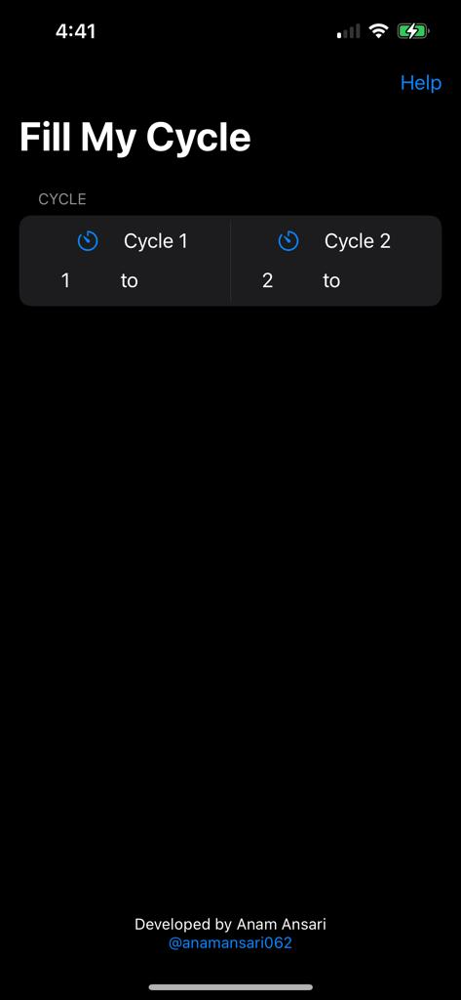
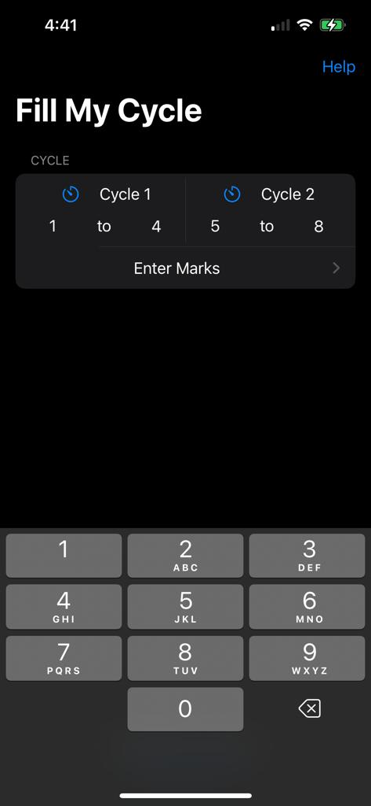
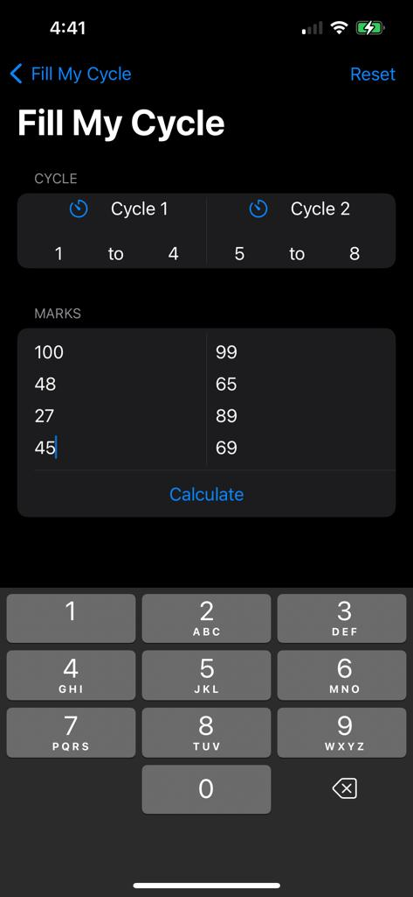
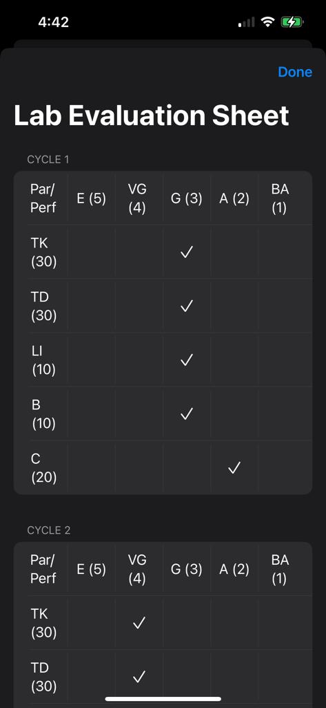

<h1 align="center">Fill My Cycle</h1>

Fill My Cycle is an Lab Evaluation Sheet generator. It takes experiments marks and generates the respective evaluation sheet. This app is the IOS Version of [FillMyCycle Android](https://play.google.com/store/apps/details?id=com.sspathare97.fillmycycle)

## How to use: 
1. Enter the cycle numbers, only 10 maximum experiments are allowed.
2. Click on Enter Marks.
3. Enter respective experiment marks. If you do not enter anything, it will be considered 0. Values above 100 will be considered 100 only.
4. Click on Calculate to get the Lab Evaluation Sheet

## Screenshot

## Demo
[Demo Video](https://youtu.be/8K3t3XawUM4)

## Pre-requisites 💻

Before installation, please make sure you have already installed the following tools: 
- [XCode 14.1](https://apps.apple.com/in/app/xcode/id497799835?mt=12) 

some other optional prerequisites if you are interested in contributing.
- [Git](https://git-scm.com/downloads)

## Contribution Guidelines 🛠️
1. Create a new issue or asked to be assigned to one
2. Fork the project
3. Clone the project
4. Create a new branch `git checkout -b new-feature`
5. Work on the issue
6. Once all the appropriate changes are done in the files ` git add . `
7. Add changes to reflect the changes made `git commit -m 'commit message'`
8. Push to the branch ` git push `
9. Create a Pull Request with proper description and screenshots/ screen-recording

## License 🛡️
FillMyCycle is licensed under the MIT License - see the [`LICENSE`](LICENSE.txt) file for more information.

## Support 🙏
Do ⭐️ the project if you like it :)
